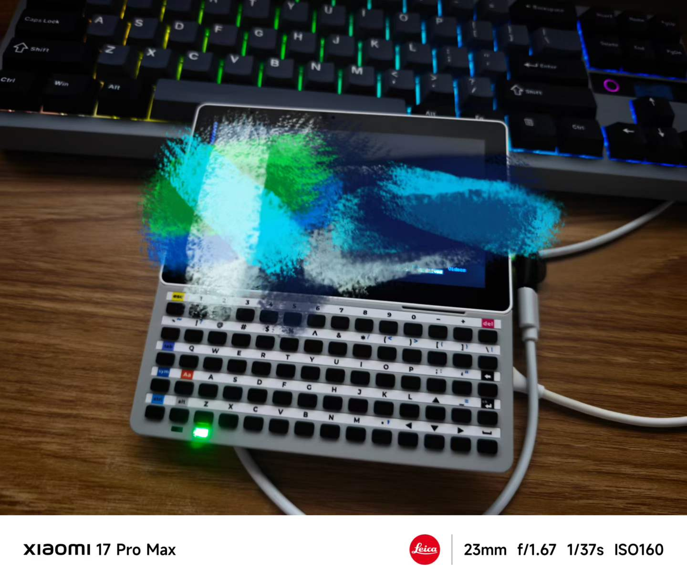

# M5Term

[English](README_EN.md)

M5Term 是一组基于 M5Stack 设备的轻量远程终端/远程桌面实验项目，目标是在小屏设备上实现常用远程访问能力。

## 项目

| 开发板 | SSH | VNC | RDP |
| --- | --- | --- | --- |
| M5Stack Cardputer | 支持 | 暂未支持 | 暂未支持 |
| M5Stack Tab5 | 支持 | 实验支持，仅支持简单 VNC/VncAuth | 暂未支持 |

## 目录

- `src/Cardputer_CLI_Arduino`: Cardputer SSH 终端。
- `src/Tab5_CLI_Arduino`: Tab5 SSH 终端。
- `src/Tab5_VNC_Arduino`: Tab5 VNC 客户端实验项目。

## 说明

VNC 当前主要面向 TigerVNC 等可配置为经典 `VncAuth` 的服务端；现代加密认证、用户名登录、剪贴板、音频和 RDP 暂未支持。
